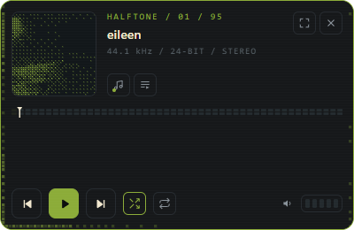
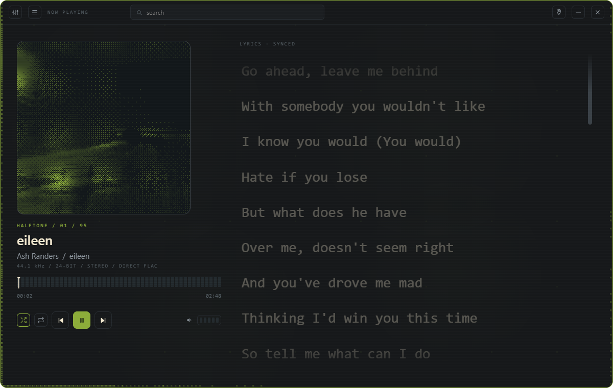
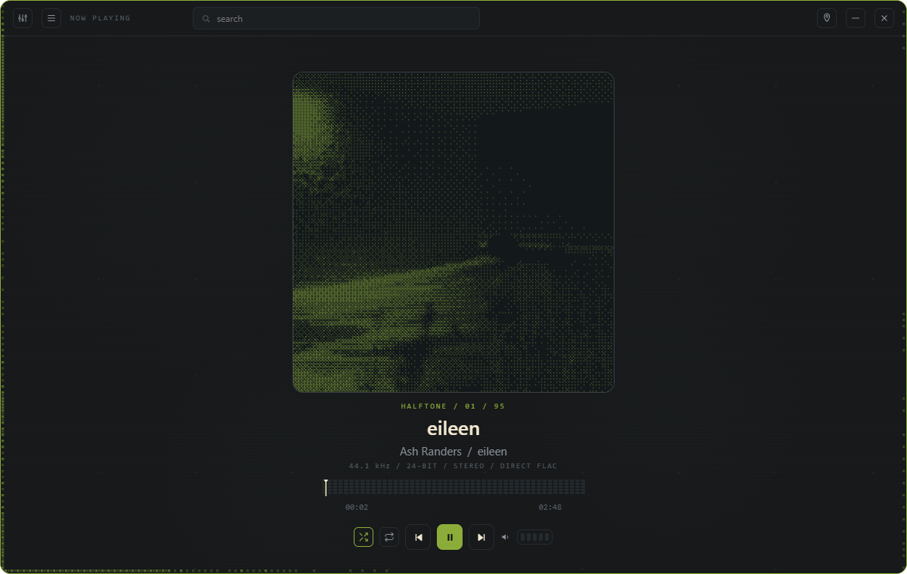
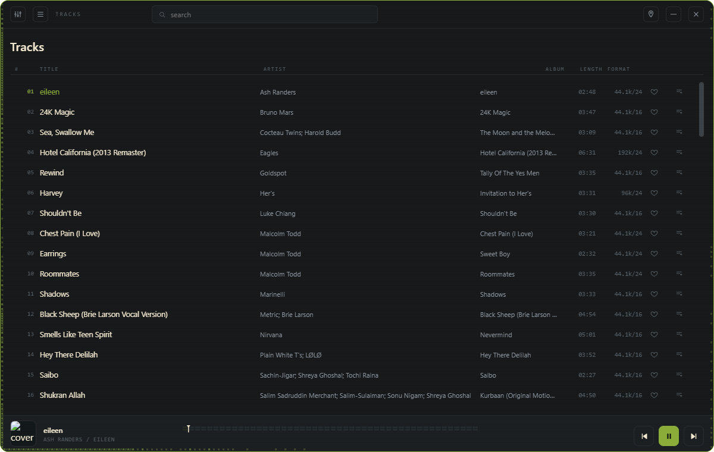
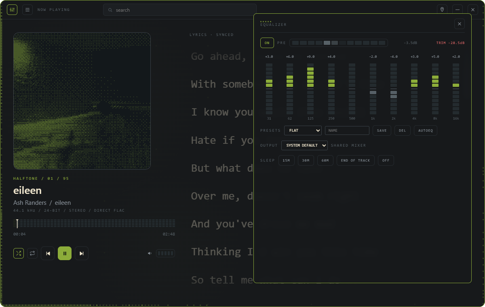

<div align="center">

# HALFTONE

**A floating dither-styled music widget + full player for your local FLAC library.**

Tauri 2 · vanilla JS · zero transcode · zero cloud

</div>

---

Halftone is a small always-on-top desktop widget that plays your local FLAC files — original
bytes, no transcoding, no streaming service — plus a full player window when you want the
library view. Both surfaces render as two views of the **same player**: same song, same
position, same theme, live-synced.

The whole UI is themed around **halftones and dither patterns**: album covers become Bayer
dither grids in a color extracted from the artwork itself, the seek bar is a 48-segment LED
spectrum meter, volume is a row of LEDs, and a music-reactive dither field breathes behind the
now-playing view.

## Screenshots

| | |
|---|---|
| **The widget** — always-on-top, resizable, scales 0.7–2.4× |  |
| **Now playing** — dither art, 28px synced lyrics, ambient dither field |  |
| **Lyrics off** — art scales into a centered hero |  |
| **Library** — tracks/albums/liked/playlists with search |  |
| **Equalizer** — 10-band LED ladders, AutoEQ import |  |

## Features

### Player
- **Direct FLAC playback** — the file's own bytes via a custom `flac://` protocol with range
  requests; nothing is re-encoded, ever (see the [audio pipeline contract](docs/audio-pipeline.md))
- Full transport: play/pause, previous (restart-if->3s), next, shuffle, repeat off/all/one
- Seek bar with hover-expand, drag-sweep physics, and scroll-wheel ±5s scrub
- LED volume — click, arrow keys, or **scroll wheel anywhere** in either window
- Library: tracks / albums / liked / playlists, debounced search, virtualized list rendering
  (handles tens of thousands of tracks)
- Recursive folder scan with live progress and cancel; folder watcher auto-rescans on changes
- Scan cache — restart doesn't rescan the whole library

### Two surfaces, one player
- The **main window** is the permanent audio owner; the widget is a pure view + controller
- Track, position (30fps broadcast), volume, shuffle/repeat, accent and EQ state stay in sync
- Widget-only mode: hide the main window, audio keeps playing, widget keeps animating
- Widget ↔ app toggle button; tray icon with menu (show/hide, transport, quit)

### OS integration (Windows)
- **SMTC**: global media keys + the OS now-playing overlay (title, artist, album, embedded
  cover art) with a working seekbar — driven by the audio owner, never the widget
- Tray icon with native menu; left-click toggles the widget

### Theming
- Accent color **extracted from the album art**, contrast-clamped to ≥3:1
- Both windows always share one theme (follow album art, or lock: mint / sky / violet / rose /
  amber / red)
- Dither art repaints *during* accent tweens — colors never lag

### Lyrics
- `.lrc` sidecar files (multi-timestamp lines supported), parsed in the same single read
- App: large 28px lines, native scrolling, auto-follow centered on the active line; wheel
  pauses follow; clicking a line seeks and resumes it
- No lyrics for the track? The art auto-scales into a centered hero — no dead pane
- Widget: collapsible pane with the same follow behavior
- lrclib.net search link when a track has no sidecar

### Equalizer
- 10-band graphic EQ (31 Hz – 16 kHz) with per-band LED ladders
- Pre-amp with automatic clipping protection (`TRIM` readout)
- True bypass — filters disconnect from the graph, not just zero out
- 7 built-in presets + user presets (save/load/delete)
- **AutoEQ import** — load any `ParametricEQ.txt` from the AutoEQ database; filters map onto
  the band chain with the profile's pre-amp, and the profile name shows while active

### Output device
- Pick any audio output via `setSinkId`; persisted across restarts; hot-plug safe (falls back
  to default if the device disappears)
- Note: routes through the Windows shared mixer — exclusive/bit-perfect output is a roadmap
  item, not the current path

### Extras
- Sleep timer (15/30/60 min, end-of-track, or off) with countdown
- ReplayGain (off / track / album) applied at the pre-amp, from tags read in the same pass
- Error toasts for everything: corrupt files, missing drives, unreadable lyrics, scan results —
  never console-only, never a silent no-op
- First-run state that explains what to do; graceful empty states everywhere

## Install

Download the latest `Halftone` installer (NSIS) from releases, or build from source. After
install: launch from the Start menu, or `Win+R` → `halftone`.

## Build from source

```
# Prereqs: Rust (MSVC), Node not required (vanilla JS frontend), Tauri 2 prerequisites on Windows
cd src-tauri
cargo build --release
# exe lands at target/release/halftone.exe
cargo tauri build        # or: produces the NSIS installer
```

`tools/install.py` is a **developer convenience only** (copies the exe to
`%LOCALAPPDATA%\Halftone`, adds PATH + App Paths + shortcuts). Testers should use the
installer.

## Scope & design principles

- **FLAC only** — MP3/M4A/WAV/OGG are detected and reported during scans, but not playable yet
- **Original bytes** — the direct-FLAC contract (one header read per track, cover art from
  `METADATA_BLOCK_PICTURE` only, no transcode) is binding; see
  [docs/audio-pipeline.md](docs/audio-pipeline.md)
- **Single audio owner** — exactly one `<audio>` element exists in the whole app; the widget
  constructs no audio objects
- **Local only** — no account, no telemetry, no network calls (except the lrclib.net link you
  click yourself)

## Known limitations

- Shared-mixer output only (no exclusive mode yet)
- Lyrics require a `.lrc` sidecar next to the FLAC (auto-fetch from lrclib is planned)
- FLAC only — other formats are on the roadmap
- Overlay rendering (SMTC seekbar, tray icon) is OS-drawn and varies slightly across
  Windows versions

## Contributing

Issues and PRs welcome — see [CONTRIBUTING.md](CONTRIBUTING.md). Please keep PRs FLAC-only and
respect the single-audio-owner architecture (the widget must not construct audio objects).

---

## Disclaimer

This project was **vibecoded — built with AI assistance** (Claude / Hermes Agent by Nous
Research) as a personal project. All design decisions, testing, and direction by a human; all
code written collaboratively with AI. No copyrighted audio or artwork is included in the
repository — the screenshots show the author's own local library.

<div align="center">

*Halftone · local music, dithered*

</div>
