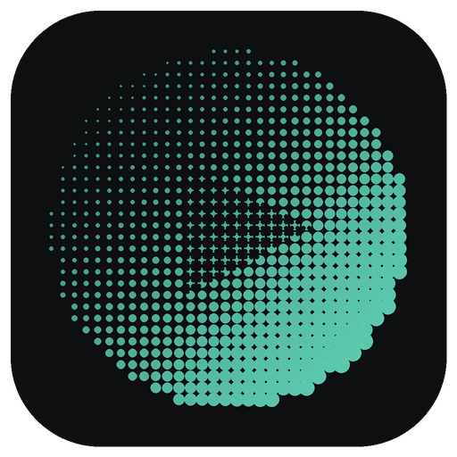
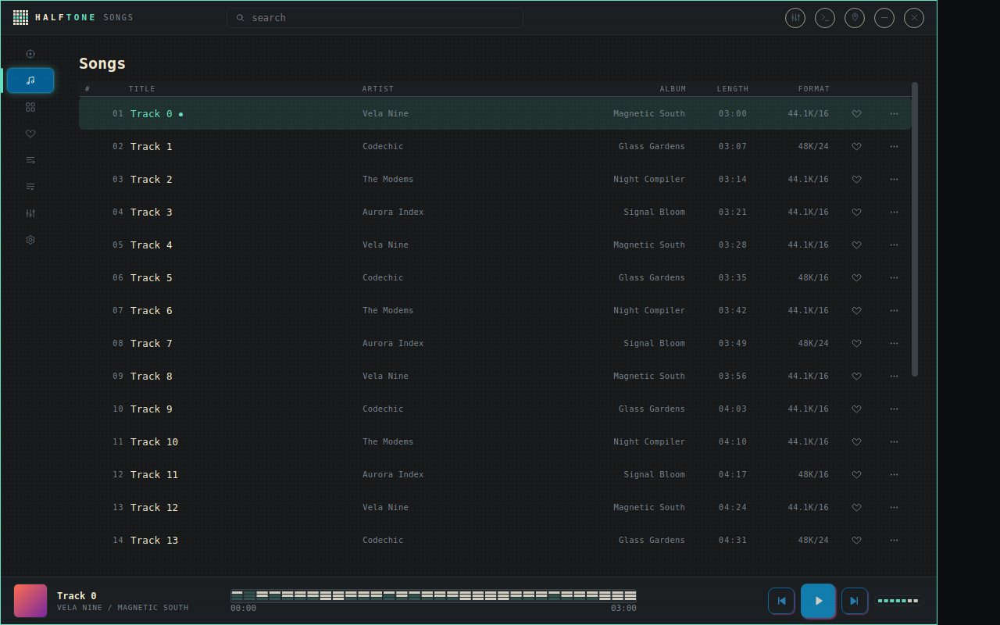
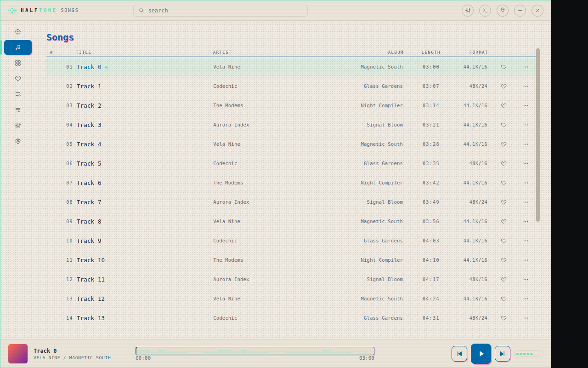
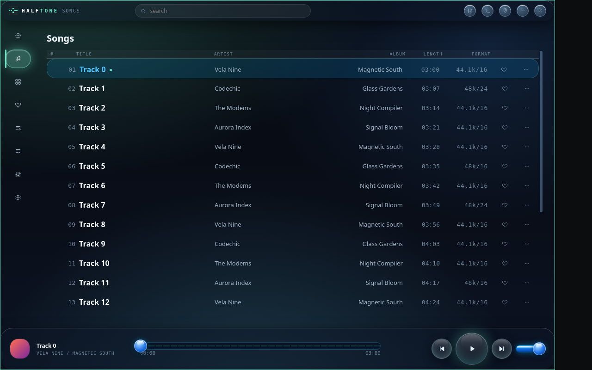
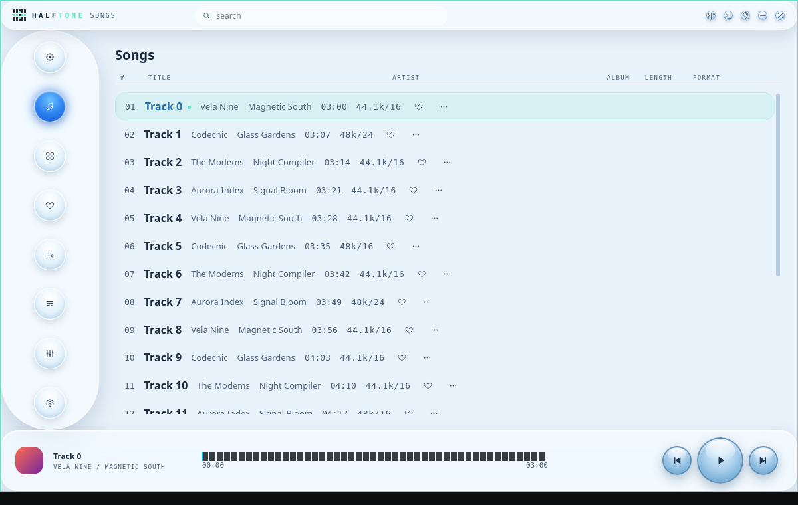
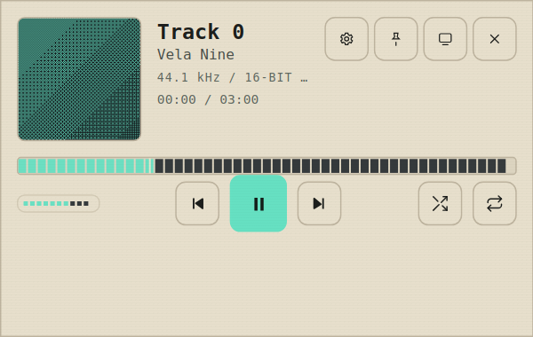
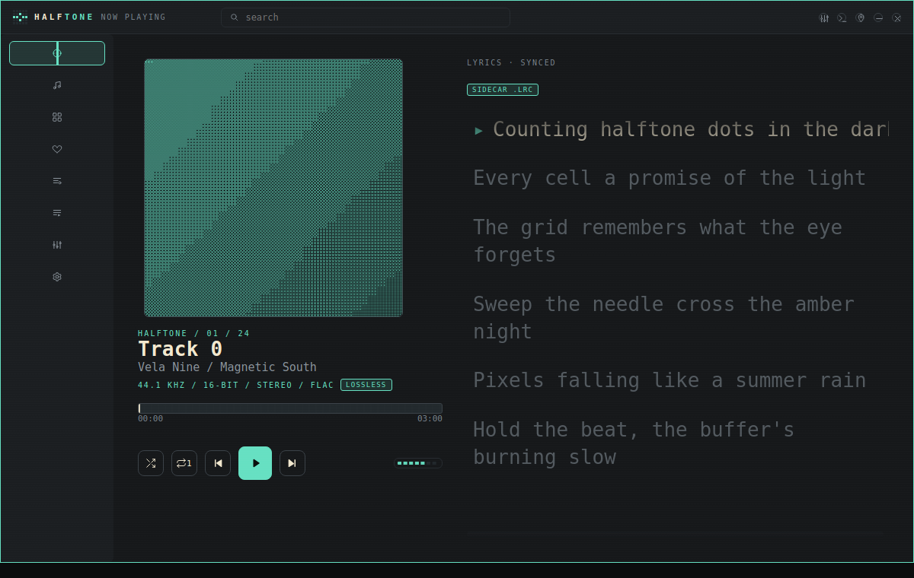
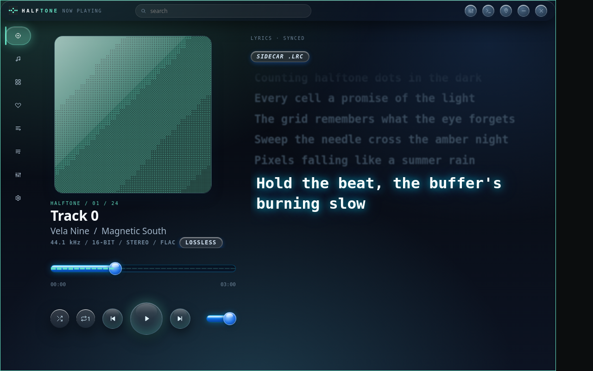
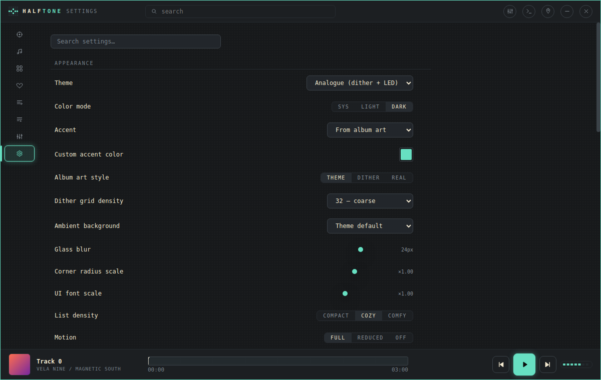

<div align="center">



# HALFTONE

**A floating dither-styled music widget + full player for your local music library.**

Tauri 2 · vanilla JS · original bytes · no cloud, no accounts

<video src="video/halftone-demo.mp4" width="660" controls></video>

https://github.com/user-attachments/assets/PLACEHOLDER

**Install (Windows · one line, no admin):**

```powershell
irm https://github.com/Trapston3/Halftone/raw/main/tools/install.ps1 | iex
```

**Install (Linux · one line — .deb via apt on Debian/Ubuntu, AppImage elsewhere):**

```sh
curl -fsSL https://github.com/Trapston3/Halftone/raw/main/tools/install.sh | sh
```

</div>

---

Halftone is a small always-on-top desktop widget that plays your local music library —
FLAC, ALAC, WAV, MP3, AAC/M4A, Ogg Vorbis and Opus, original bytes, no transcoding, no
streaming service — plus a full player window when you want the library view. Both surfaces
render as two views of the **same player**: same song, same position, same theme, live-synced.
Windows is the primary platform; Linux builds are experimental.

The **Analogue** theme is built around **halftones and dither patterns**: album covers become
Bayer dither grids in a color extracted from the artwork itself, the seek bar is a 48-segment
LED spectrum meter, volume is a row of LEDs, and a music-reactive dither field breathes behind
the now-playing view (dark); light mode is a fresh **risograph** style — warm paper grain with
riso blue and fluoro-pink spot inks. The **Digital** theme trades dither for **Frutiger Aero ×
liquid glass** — translucent panels, blur and gloss (dark mode is full liquid glass with
art-accent ambient blobs) — with the same layout and feature set underneath.

## Screenshots

| | |
|---|---|
| **Analogue (dark)** — the library: dither art, LED seek, mono/print chrome |  |
| **Analogue (light)** — new risograph style: warm paper, riso blue + fluoro pink inks |  |
| **Digital (dark)** — liquid glass: art-accent ambient blobs, glass panels, glow |  |
| **Digital (light)** — Frutiger Aero × liquid glass, same layout underneath |  |
| **The widget** — always-on-top, card/strip/square/lyrics presets, synced live |  |
| **Now playing** — 28px synced lyrics with auto-follow, ambient dither field |  |
| **Seekbar spectrum** — micro bars inside the gel tube, animated while playing |  |
| **Searchable settings** — generated, filtered, applied live |  |

## Features

### Player
- **Direct playback of the file's own bytes** — FLAC, ALAC, WAV, MP3, AAC/M4A, Ogg Vorbis
  and Opus via the format-neutral `media://` protocol with range requests; nothing is
  re-encoded (ALAC is decoded losslessly in Rust — see the
  [audio pipeline contract](docs/audio-pipeline.md)); every track shows a `LOSSLESS`/`LOSSY` badge
- Full transport: play/pause, previous (restart-if->3s), next, shuffle, repeat off/all/one
- **Play queue** — play next / add to queue from any row's menu
- Seek bar with hover-expand, drag-sweep physics, and scroll-wheel ±5s scrub —
  with a **spectrum visualiser inside it**: micro bars in the gel tube (Digital) /
  LED columns (Analogue) dancing while a track plays, in the app, mini-bar and widget
- LED volume — click, arrow keys, or **scroll wheel anywhere** in either window
- Library: tracks / albums / liked / playlists, debounced search, virtualized list rendering
  (handles tens of thousands of tracks)
- Fast recursive folder scan — bounded reads, parallel parsing, live progress and cancel;
  folder watcher auto-rescans on changes
- Scan index cache — restart doesn't rescan the whole library

### Two surfaces, one player
- The **main window** is the permanent audio owner; the widget is a pure view + controller
- Track, position (30fps broadcast), volume, shuffle/repeat, accent and EQ state stay in sync
- Widget-only mode: hide the main window, audio keeps playing, widget keeps animating
- Widget ↔ app toggle button; tray icon with menu (show/hide, transport, quit)

### OS integration
- **Windows — SMTC**: global media keys + the OS now-playing overlay (title, artist, album,
  cover art) with a working seekbar — driven by the audio owner, never the widget
- **Linux — MPRIS**: the same surface over D-Bus (`souvlaki`), incl. seek and seek-by
- Tray icon with native menu; left-click toggles the widget

### Theming
- **Two themes**: **Analogue** (dither/LED) and **Digital** (Frutiger Aero × liquid glass),
  each with **light + dark** mode — follow the system or lock one. Analogue dark is
  dither/LED; **Analogue light is a risograph style** (warm paper, riso ink). Digital dark
  is **liquid glass** (ambient art blobs, blur, specular sheen); Digital light is Frutiger Aero
- Animated theme/mode switching: a **circular reveal** expands from your pointer
  (View Transitions; graceful crossfade fallback), both windows switch together
- **Slight glow** on the active chrome and **animated transitions between states** —
  buttons, LEDs and panels respond live; motion can be reduced or turned off
- Accent color **extracted from the album art**, contrast-clamped to ≥3:1, or locked:
  mint / sky / violet / rose / amber / red
- Dither art repaints *during* accent tweens — colors never lag

### Layout & settings
- **Highly configurable**: nav as left/right rail, top tabs, **bottom dock**, or hidden;
  **nav rail expand / collapse (icons-only) / fully hidden, persisted, toggled with
  Ctrl+B**; queue panel left/right/off; now-playing layouts (split / stacked / hero);
  mini-bar on/off; density, corner radius, UI font scale, motion (full / reduced / off) —
  all applied live
- A generated, searchable settings page in the main window and a settings sheet in the widget
- **Widget presets** — card / compact strip / square art / lyrics-focus — with
  fit-to-window or fixed-% scaling that never letterboxes or blurs

### Lyrics
- **Automatic**: sidecar `.lrc` → embedded tags → local cache → **LRCLIB** lookup, synced or
  plain, with a sync offset and a status line ("searching…" → source → retry)
- App: large 28px lines, native scrolling, auto-follow centered on the active line; wheel
  pauses follow; clicking a line seeks and resumes it
- No lyrics for the track? The art auto-scales into a centered hero — no dead pane
- Widget: collapsible pane with the same follow behavior
- Online lookup can be turned off in Settings; the lrclib.net search link opens the browser
  only when you click it

### Cover art
- Files without embedded art get cover art **automatically** — looked up from
  iTunes and MusicBrainz / Cover Art Archive (no API keys) and cached locally
- **Right-click → Change cover art**: import an image, search the web, or reset to
  embedded/auto — your choice is remembered across restarts and applies per album
- Priority: **your choice > embedded art > web**; failed lookups are retried
  after 7 days
- Turn the automatic lookups off with **"Fetch missing cover art online"** in
  Settings

### Equalizer
- 10-band graphic EQ (31 Hz – 16 kHz) with per-band LED ladders
- Pre-amp with automatic clipping protection (`TRIM` readout)
- True bypass — filters disconnect from the graph, not just zero out
- 7 built-in presets + user presets (save/load/delete)
- **AutoEQ import** — load any `ParametricEQ.txt` from the AutoEQ database; filters map onto
  the band chain with the profile's pre-amp, and the profile name shows while active

### Output device
- Pick any audio output via `setSinkId`; persisted across restarts; hot-plug safe (falls back
  to default if the device disappears)
- Note: routes through the Windows shared mixer — exclusive/bit-perfect output is a roadmap
  item, not the current path

### Updates
- **OTA self-update** (Windows): check → download → **sha256 + size verified** → staged
  atomically → swapped in on restart, keeping all settings and library data — see
  [docs/OTA.md](docs/OTA.md)
- Linux installs update by re-running the installer; the check itself can be disabled
  (Settings / `HALFTONE_NO_OTA`)

### Extras
- Sleep timer (15/30/60 min, end-of-track, or off) with countdown
- ReplayGain (off / track / album) applied at the pre-amp, from tags read in the same pass
- Error toasts for everything: corrupt files, missing drives, unreadable lyrics, scan results —
  never console-only, never a silent no-op
- First-run state that explains what to do; graceful empty states everywhere

## Install

**One line (Windows, no admin):**

```powershell
irm https://github.com/Trapston3/Halftone/raw/main/tools/install.ps1 | iex
```

Downloads the standalone exe to `%LOCALAPPDATA%\Halftone`, adds it to your user PATH
(`halftone` from Win+R or any shell), registers App Paths, and creates Desktop + Start Menu
shortcuts. Re-running it upgrades in place.

**One line (Linux, x86_64 — sudo only for the .deb path):**

```sh
curl -fsSL https://github.com/Trapston3/Halftone/raw/main/tools/install.sh | sh
```

On Debian/Ubuntu it installs `Halftone_amd64.deb` via apt (dependencies included);
everywhere else — or with `sh -s -- --appimage` — it installs `Halftone_amd64.AppImage`
to `~/.local/share/halftone` with a launcher and menu entry. FUSE-less systems get a
`--appimage-extract-and-run` launcher automatically. Re-running it upgrades in place.

Both scripts download the latest release, verify sha256 checksums when the release publishes
them, and install for the current user only.

**Manual download:** from
[Releases](https://github.com/Trapston3/Halftone/releases) grab
[`Halftone.exe`](https://github.com/Trapston3/Halftone/releases/latest/download/Halftone.exe)
(Windows — just run it) or
[`Halftone_amd64.AppImage`](https://github.com/Trapston3/Halftone/releases/latest/download/Halftone_amd64.AppImage)
/ [`Halftone_amd64.deb`](https://github.com/Trapston3/Halftone/releases/latest/download/Halftone_amd64.deb)
(Linux) — same app, minus the PATH/shortcut setup.

**Uninstall & troubleshooting:** see [docs/INSTALL.md](docs/INSTALL.md).

**Build from source:** see below.

## Build from source

Windows (primary):

```
# Prereqs: Rust (MSVC), Node not required (vanilla JS frontend), Tauri 2 prerequisites
cd src-tauri
cargo build --release
# exe lands at target/release/halftone.exe
cargo tauri build        # or: produces the NSIS installer
```

`tools/install.py` is a **developer convenience only** (copies the exe to
`%LOCALAPPDATA%\Halftone`, adds PATH + App Paths + shortcuts). Testers should use the
installer.

**Releases** are staged with `tools/release.py` (asset naming, `latest.json`, sha256) and
published by CI on `v*` tags — the full flow is documented in
[docs/OTA.md](docs/OTA.md).

## Linux (experimental)

Windows is the primary platform; Linux builds work but are untested on real
desktops. The backend is platform-neutral Rust — same commands, same events;
the only OS-specific piece is media integration (SMTC on Windows via
WebView2's `navigator.mediaSession`, MPRIS on Linux via `souvlaki` over
D-Bus).

```
# Build deps (Ubuntu 24.04 / Debian):
sudo apt install libwebkit2gtk-4.1-dev libayatana-appindicator3-dev \
  librsvg2-dev libdbus-1-dev build-essential curl file pkg-config

# From the repo root:
cargo install tauri-cli --version "^2"   # or: cargo tauri build via npx
cd src-tauri
cargo tauri build -b deb,appimage
# Artifacts: src-tauri/target/release/halftone (and .deb / .AppImage bundles)
```

Notes:

- WebView2 → webkit2gtk: custom `media://` URLs resolve as
  `media://localhost/...` (the Windows `http://media.localhost/...` form is
  WebView2-specific); the backend serves both.
- The tray uses the ayatana appindicator; GNOME needs an AppIndicator
  extension enabled to see it.
- MPRIS needs a running session D-Bus (any desktop session). Without one the
  app logs `mpris: unavailable` and keeps playing.

## Scope & design principles

- **Multi-format, original bytes** — FLAC, ALAC, WAV, MP3, AAC/M4A, Ogg Vorbis and Opus are
  served as the file's own bytes (ALAC: decoded losslessly in Rust — the one documented
  exception); format detection is by magic bytes, never extension; see
  [docs/audio-pipeline.md](docs/audio-pipeline.md)
- **Single audio owner** — exactly one `<audio>` element exists in the whole app; the widget
  constructs no audio objects
- **Local first, network only where you allow it** — no account, no telemetry. The only
  network calls are LRCLIB lyrics lookups, cover-art lookups (iTunes Search API +
  MusicBrainz / Cover Art Archive — artist and album name only) and OTA
  update checks — each one can be disabled in Settings (cover art:
  "Fetch missing cover art online"; OTA also honors `HALFTONE_NO_OTA`)

## Known limitations

- Shared-mixer output only on Windows (no exclusive mode yet)
- OTA self-update is Windows-only; Linux updates by re-running the installer
- Linux builds work but are untested on real desktops
- Overlay rendering (SMTC seekbar, tray icon) is OS-drawn and varies slightly across
  Windows versions

## Contributing

Issues and PRs welcome — see [CONTRIBUTING.md](CONTRIBUTING.md). Please respect the
single-audio-owner architecture (the widget must not construct audio objects) and the
theme/foundation split in [docs/UI_CONTRACT.md](docs/UI_CONTRACT.md).

---

## Disclaimer

This project was **vibecoded — built with AI assistance** (Claude / Hermes Agent by Nous
Research) as a personal project. All design decisions, testing, and direction by a human; all
code written collaboratively with AI. No copyrighted audio or artwork is included in the
repository — the screenshots show the author's own local library.

<div align="center">

*Halftone · local music, dithered*

</div>
